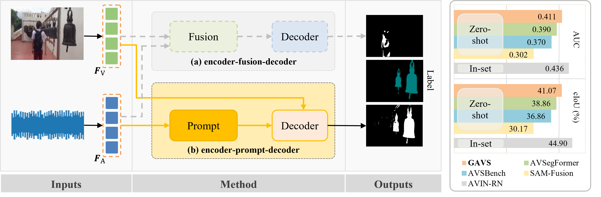
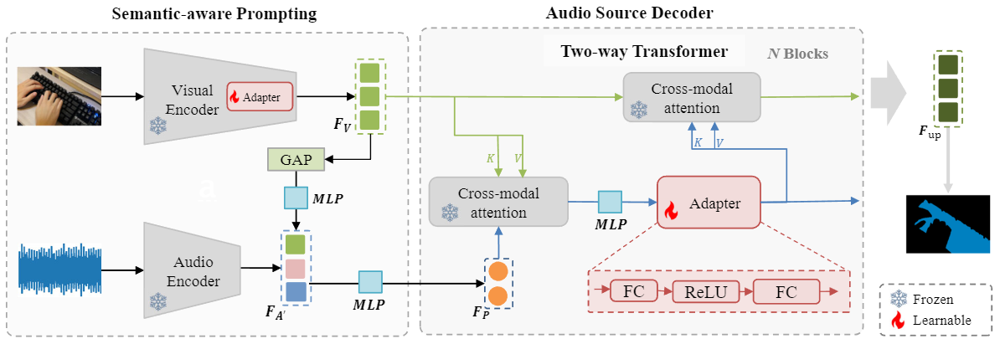
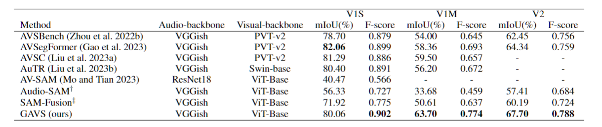
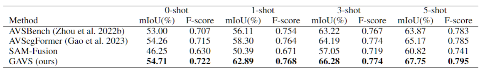
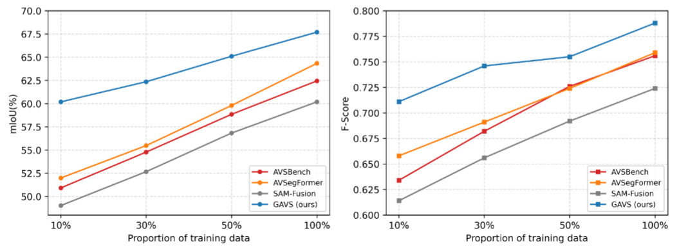
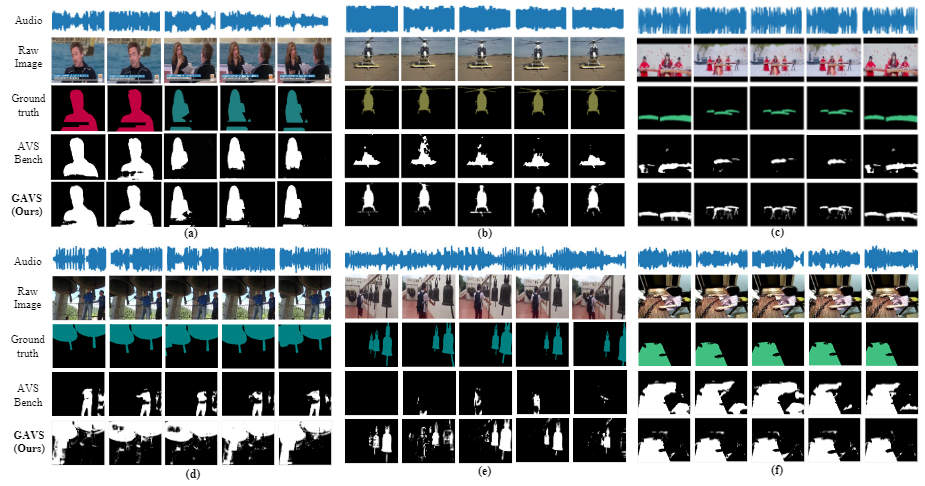

# Prompting Segmentation with Sound Is Generalizable Audio-Visual Source Localizer
## GAVS: Generalizable-Audio-Visual-Segmentation
Official repository of "Prompting Segmentation with Sound is Generalizable Audio-Visual Source Localizer", AAAI 2024

arXiv: https://arxiv.org/abs/2309.07929

# Abstract
Never having seen an object and heard its sound simultaneously, can the model still accurately localize its visual position from the input audio? In this work, we concentrate on the Audio-Visual Localization and Segmentation tasks but under the demanding zero-shot and few-shot scenarios. To achieve this goal, different from existing approaches that mostly employ the encoder-fusion-decoder paradigm to decode localization information from the fused audio-visual feature, we introduce the encoder-prompt-decoder paradigm, aiming to better fit the data scarcity and varying data distribution dilemmas with the help of abundant knowledge from pre-trained models. Specifically, we first propose to construct a Semantic-aware Audio Prompt (SAP) to help the visual foundation model focus on sounding objects, meanwhile, the semantic gap between the visual and audio modalities is also encouraged to shrink. Then, we develop a Correlation Adapter (ColA) to keep minimal training efforts as well as maintain adequate knowledge of the visual foundation model. By equipping with these means, extensive experiments demonstrate that this new paradigm outperforms other fusion-based methods in both the unseen class and cross-dataset settings. We hope that our work can further promote the generalization study of Audio-Visual Localization and Segmentation in practical application scenarios.

# Highlight

### Motivation
Due to the scarcity of AVS data and the varying data distribution in real-world scenarios, the model is hard to learn strong audio-visual correlation well. We expect to use audio information to `prompt` the powerful `visual foundation model` like Segment Anything Model (SAM) by utilizing the inlined visual priors to adapt to downstream data, thereby achieving generalizable audio-visual segmentation (GAVS). We lso develop ColA to keep minimal training efforts as well as maintain adequate knowledge of the visual foundation model.  

### AVS-V3 dataset
We develop the V3 dataset for analyzing the generalization ability of audio-visual segmentation models.   
- For zero-shot, you should train with "meta_v3_seen_train", eval with "meta_v3_seen_val", then test with "meta_v3_unseen".

- For other few-shot settings, the val set is remained (i.e., "meta_v3_seen_val"), and incrementally train with "/v3_x_shot/train" for 10 epochs based on the model trained with "meta_v3_seen_train", and test with "/v3_x_shot/test".

- See "./segment_anything/dataset/avs_bench_zsfs.py".

# 1. Comparison with traditional AVS models


The AVS pipeline comprises the classical encoder-fusion-decoder (upper-center) and our proposed encoder-prompt-decoder (lower-center) paradigms. The traditional method decodes the mask from the fused modality, while our approach prompts visual input with audio to adapt AVL and AVS tasks to the visual foundational model. Results on the VGG-SS dataset underscore the challenge of generalizing across different datasets. Nevertheless, our approach surpasses the 40% cIoU barrier, achieving performance closer to the best-trained in-set (VGG-Sound) methods.

# 2. Model architecture



The overview of GAVS. (1) We firstly align the audio and visual semantics for SAP, and introduce visual features as cues (the green one in $F_{A'}$) for audio input (the blue one in $F_{A'}$). Then we further combine audio input with learnable adaptive noise (the pink one in $F_{A'}$) to construct the final SAP $F_{A'}$, and get the projected prompt $F_{P}$ . (2) Next, we utilize cross-modal attention to learn the correlation between audio and visual in the Audio Source Decoder, projecting audio into the visual space. The self-attention for $F_{P}$ before the first cross-modal attention is omitted for clarity.

# 3. Experiments
## 3.1 AVS-Benchmarks
**Performance on AVS-Benchmarks**

**Performance on AVS-V3**

test the generalization ability on unseen object classes.
## 3.2 Data efficiency

 Our model performs better with just 10% of the training data compared to other models trained with 30%. It even outperforms models trained on the full dataset when trained with only 50% of the data.
# 4. Qualitative results

 Our method successfully visualizes segmented masks for unseen classes in the AVS-V2 and AVS-V3 zero-shot test sets. It accurately identifies objects despite their semantic classes being absent from the training set, demonstrating superior zero-shot generalization abilities over AVSBench's encoder-fusion-decoder approach.
# 5. Run
## 5.1 run scripts
\> cd segment_anything  
\> sh run_v1m.sh

## 5.2 Path
All path configured should be found in dataset/avs_bench.py  

## 5.3 SAM checkpoint  
Please check this [link](https://github.com/facebookresearch/segment-anything) to get started with Segment Anything Model and download the pretrained weights.

## 5.4 VGGish for audio feature extraction  
VGGish was originally a audio model developed by Google based on TensorFlow.

Please find in this [repository](https://github.com/harritaylor/torchvggish) to extract the audio feature with *PyTorch*.

Additionally, you may find off-line method is more convenient:

(1) Use [Towhee](https://link.zhihu.com/?target=https%3A//github.com/towhee-io)
```
from towhee import pipe, ops

p = (  # pipeline building
      pipe.input('path')
          .map('path', 'frame', ops.audio_decode.ffmpeg())
          .map('frame', 'vecs', ops.audio_embedding.vggish())
          .output('vecs')
)

emb = p('audio_example.wav').get()[0]  # shape=[n_seconds, 128]
```

(2) With Google Colab: [link](https://colab.research.google.com/drive/1r_8OnmwXKwmH0n4RxBfuICVBgpbJt_Fs?usp=sharing#scrollTo=MJWFPPSoAQzF).

# 6. Citation
We appreciate your citation if you found our work is helpful:
```
@article{wang2023prompting,
  title={Prompting Segmentation with Sound is Generalizable Audio-Visual Source Localizer},
  author={Wang, Yaoting and Liu, Weisong and Li, Guangyao and Ding, Jian and Hu, Di and Li, Xi},
  journal={arXiv preprint arXiv:2309.07929},
  year={2023}
}
```
