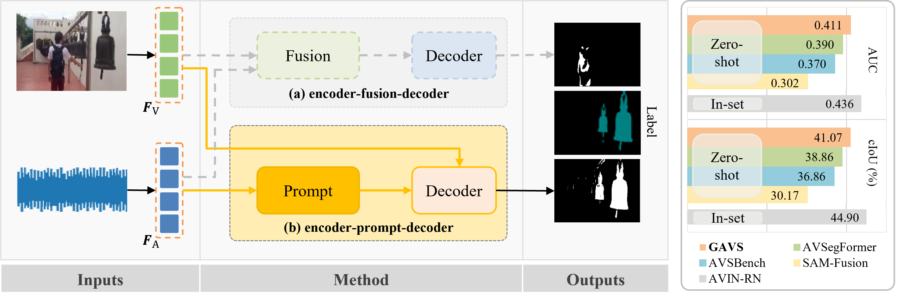
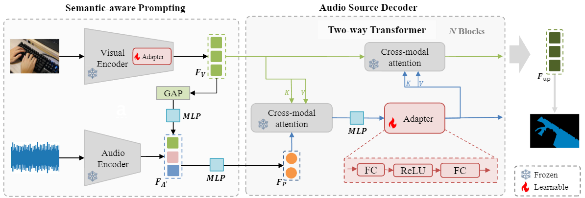
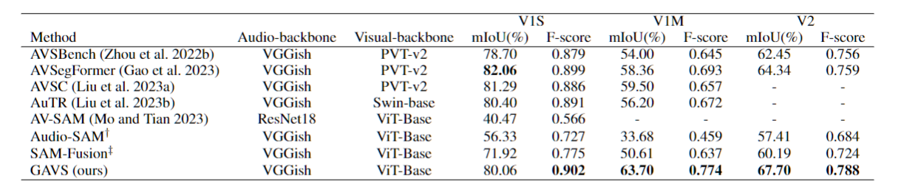
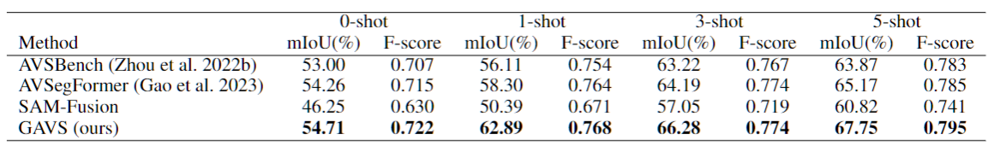
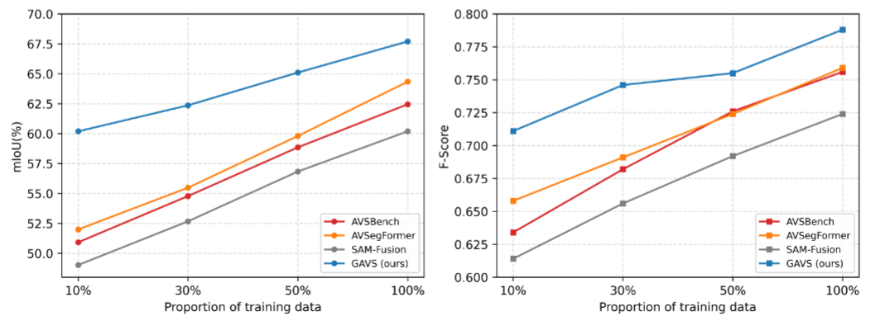
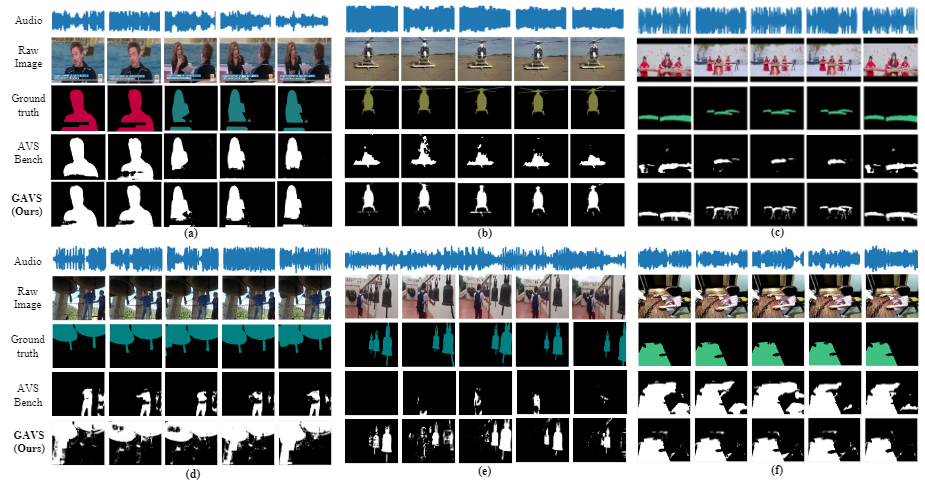

This project has been re-optimized by Claude Code.

# Prompting Segmentation with Sound Is Generalizable Audio-Visual Source Localizer
## GAVS: Generalizable-Audio-Visual-Segmentation
Official repository of "Prompting Segmentation with Sound is Generalizable Audio-Visual Source Localizer", AAAI 2024

arXiv: https://arxiv.org/abs/2309.07929

# Abstract
Never having seen an object and heard its sound simultaneously, can the model still accurately localize its visual position from the input audio? In this work, we concentrate on the Audio-Visual Localization and Segmentation tasks but under the demanding zero-shot and few-shot scenarios. To achieve this goal, different from existing approaches that mostly employ the encoder-fusion-decoder paradigm to decode localization information from the fused audio-visual feature, we introduce the encoder-prompt-decoder paradigm, aiming to better fit the data scarcity and varying data distribution dilemmas with the help of abundant knowledge from pre-trained models. Specifically, we first propose to construct a Semantic-aware Audio Prompt (SAP) to help the visual foundation model focus on sounding objects, meanwhile, the semantic gap between the visual and audio modalities is also encouraged to shrink. Then, we develop a Correlation Adapter (ColA) to keep minimal training efforts as well as maintain adequate knowledge of the visual foundation model. By equipping with these means, extensive experiments demonstrate that this new paradigm outperforms other fusion-based methods in both the unseen class and cross-dataset settings. We hope that our work can further promote the generalization study of Audio-Visual Localization and Segmentation in practical application scenarios.

# Highlight

### Motivation
Due to the scarcity of AVS data and the varying data distribution in real-world scenarios, the model is hard to learn strong audio-visual correlation well. We expect to use audio information to `prompt` the powerful `visual foundation model` like Segment Anything Model (SAM) by utilizing the inlined visual priors to adapt to downstream data, thereby achieving generalizable audio-visual segmentation (GAVS). We lso develop ColA to keep minimal training efforts as well as maintain adequate knowledge of the visual foundation model.  

### AVS-V3 dataset
We develop the V3 dataset for analyzing the generalization ability of audio-visual segmentation models.   
- For zero-shot, you should train with "meta_v3_seen_train", eval with "meta_v3_seen_val", then test with "meta_v3_unseen".

- For other few-shot settings, the val set is remained (i.e., "meta_v3_seen_val"), and incrementally train with "/v3_x_shot/train" for 10 epochs based on the model trained with "meta_v3_seen_train", and test with "/v3_x_shot/test".

- See "./segment_anything/dataset/avs_bench_zsfs.py".

# 1. Comparison with traditional AVS models


The AVS pipeline comprises the classical encoder-fusion-decoder (upper-center) and our proposed encoder-prompt-decoder (lower-center) paradigms. The traditional method decodes the mask from the fused modality, while our approach prompts visual input with audio to adapt AVL and AVS tasks to the visual foundational model. Results on the VGG-SS dataset underscore the challenge of generalizing across different datasets. Nevertheless, our approach surpasses the 40% cIoU barrier, achieving performance closer to the best-trained in-set (VGG-Sound) methods.

# 2. Model architecture



The overview of GAVS. (1) We firstly align the audio and visual semantics for SAP, and introduce visual features as cues (the green one in $F_{A'}$) for audio input (the blue one in $F_{A'}$). Then we further combine audio input with learnable adaptive noise (the pink one in $F_{A'}$) to construct the final SAP $F_{A'}$, and get the projected prompt $F_{P}$ . (2) Next, we utilize cross-modal attention to learn the correlation between audio and visual in the Audio Source Decoder, projecting audio into the visual space. The self-attention for $F_{P}$ before the first cross-modal attention is omitted for clarity.

# 3. Experiments
## 3.1 AVS-Benchmarks
**Performance on AVS-Benchmarks**

**Performance on AVS-V3**

test the generalization ability on unseen object classes.
## 3.2 Data efficiency

 Our model performs better with just 10% of the training data compared to other models trained with 30%. It even outperforms models trained on the full dataset when trained with only 50% of the data.
# 4. Qualitative results

 Our method successfully visualizes segmented masks for unseen classes in the AVS-V2 and AVS-V3 zero-shot test sets. It accurately identifies objects despite their semantic classes being absent from the training set, demonstrating superior zero-shot generalization abilities over AVSBench's encoder-fusion-decoder approach.
# 5. Run
## 5.1 Run scripts

All datasets (v1s, v1m, v3) are trained via the unified `run.py` with the `--data` flag.

### Single GPU
```bash
cd segment_anything
python run.py --data v1m --tune_v 8 --train --val val --loss bce
```

### Multi-GPU (DDP)
```bash
cd segment_anything
torchrun --nproc_per_node=8 run.py --data v1m --tune_v 8 --train --val val --loss bce
```

### Examples
```bash
# AVS-V1s (single-sound, 5 frames)
torchrun --nproc_per_node=8 run.py --data v1s --tune_v 8 --train --val val --loss bce

# AVS-V1m (multi-sound, 5 frames)
torchrun --nproc_per_node=8 run.py --data v1m --tune_v 8 --train --val val --loss bce

# AVS-V3 (zero-shot: train on seen classes, test on unseen)
torchrun --nproc_per_node=8 run.py --data v3 --tune_v 8 --train --val val --loss bce
```

### Key arguments
- `--data {v1s,v1m,v3}`: Dataset version.
- `--tune_v N`: Apply LoRA starting from encoder block N (0-11). E.g., `--tune_v 8` fine-tunes blocks 8-11.
- `--nproc_per_node`: Number of GPUs to use.
- `--val {val,test}`: Evaluate on val or test split.

## 5.2 Data Structure

```
GAVS/
├── data/AVS/
│   ├── metadata.csv              # Shared metadata for v1s, v1m, v2
│   ├── v1s/{vid}/                # V1s videos (single-sound, 5 frames)
│   │   ├── frames/{0..4}.jpg
│   │   └── labels_rgb/{0..4}.png
│   ├── v1m/{vid}/                # V1m videos (multi-sound, 5 frames)
│   │   ├── frames/{0..4}.jpg
│   │   └── labels_rgb/{0..4}.png
│   └── v2/{vid}/                 # V2 videos (10 frames)
│       ├── frames/{0..9}.jpg
│       └── labels_rgb/{0..9}.png
│
├── GAVS/segment_anything/
│   ├── checkpoint/
│   │   └── sam_vit_b_01ec64.pth  # SAM ViT-B pretrained weights
│   ├── dataset/
│   │   └── v3/                   # V3 metadata (re-split of v1m+v2 for zero-shot)
│   │       ├── meta_v3_seen_train.csv
│   │       ├── meta_v3_seen_val.csv
│   │       ├── meta_v3_unseen.csv
│   │       └── v3_{1,3,5}_shot/  # Few-shot splits
│   └── feature_extract/
│       ├── v1s_vggish_embs/      # VGGish audio embeddings
│       ├── v1m_vggish_embs/
│       └── v2_vggish_embs/
```

## 5.3 Download data

### AVS-Bench dataset

Download from the official [AVSBench](https://www.avlbench.info/) project page and organize as follows:

```bash
mkdir -p data/AVS
# Download and unzip v1s, v1m, v2 into data/AVS/
unzip v1s.zip -d data/AVS/
unzip v1m.zip -d data/AVS/
unzip v2.zip  -d data/AVS/
```

The shared metadata file `data/AVS/metadata.csv` is included in the download.

### V3 metadata (zero-shot / few-shot splits)

V3 does not contain new video data — it re-splits v1m and v2 for generalization evaluation. The metadata CSVs are already included in the repository at `GAVS/segment_anything/dataset/v3/`.

### SAM checkpoint

Download the SAM ViT-B pretrained weights:

```bash
cd GAVS/segment_anything/checkpoint/
wget https://dl.fbaipublicfiles.com/segment_anything/sam_vit_b_01ec64.pth
```

Other model variants are available at [segment-anything](https://github.com/facebookresearch/segment-anything#model-checkpoints).

## 5.4 VGGish audio feature extraction

We provide `extract_vggish.py` to extract VGGish embeddings from raw audio. It uses [torchvggish](https://github.com/harritaylor/torchvggish) and automatically pads/truncates to the correct number of frames (5 for v1s/v1m, 10 for v2).

```bash
cd segment_anything

# Extract for each dataset version
python extract_vggish.py --ver v1s
python extract_vggish.py --ver v1m
python extract_vggish.py --ver v2
```

Output is saved to `feature_extract/{ver}_vggish_embs/{vid}.npy` with shape `[num_frames, 128]`.

Each video directory must contain an `audio.wav` file. Already extracted embeddings are automatically skipped.

# 6. Citation
We appreciate your citation if you found our work is helpful:
```
@article{wang2023prompting,
  title={Prompting Segmentation with Sound is Generalizable Audio-Visual Source Localizer},
  author={Wang, Yaoting and Liu, Weisong and Li, Guangyao and Ding, Jian and Hu, Di and Li, Xi},
  journal={arXiv preprint arXiv:2309.07929},
  year={2023}
}
```
